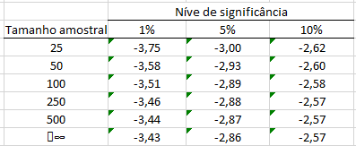

Operações Long-Short por Cointegração é uma estratégia de investimento em ativos que consiste em encontrar pares de ações (índices ou commodities) que mantém um padrão de comportamento estável e previsível (equilíbrio estacionário) com variações de curto prazo que permita ser explorado em operações de Long (compra) e Short (venda) do par. Este R-Notebook refaz o passo-a-passo nas análises estatísticas necessárias para detectar e operação essa estratégia de mercado.

## Introdução

A ideia tradicional de uma reversão de “Pair Trading” é encontrar dois ativos distintos, compartilhando fatores subjacentes que afetam seus movimentos, por exemplo, McDonald’s e Burger King. Os preços das ações de longo prazo provavelmente estarão em equilíbrio devido aos amplos fatores de mercado que afetam a produção e o consumo de hambúrguer. Uma interrupção de curto prazo para um indivíduo no par, como uma interrupção na cadeia de fornecimento que afeta apenas o McDonald’s, levaria a um deslocamento temporário em seus preços relativos.

Isso significa que uma negociação de curto prazo realizada nesse ponto de interrupção deve se tornar lucrativa, pois as duas ações retornam ao seu valor de equilíbrio assim que a interrupção for resolvida.

Encontrar pares de ativos ou índices que se comportem desta maneira possibilita abrir operações Long (compra) e short (venda) simultâneas quando os ativos se “afastam” momentaneamente do movimento conjunto, e se encerra quando elas retornam para o padrão. Ganha-se então com a variação da diferença (ou a distância) entre os dois.

## Análise de Cointegração usando R

Análise de Cointegração e Operação Long-Short consiste sumariamente em:

1. Identificar uma relação histórica entre dois ativos, ou seja, quando um sobe o outro sobe, quando um cai o outro cai (em termos percentuais fica fácil);
2. Visualizar um momento em que há uma divergência neste percentual entre os dois ativos;
3. Compra A e vende B (aluga e vende);
4. Ao retornar para o percentual histórico desejado desfaz a operação, ou seja, compra B e vende A.

O ideal ao se fazer o Long/Short é que ele seja feito no mesmo financeiro (cash-neutro). Neste caso, não há a preocupação se a bolsa sobe ou desce, o que importa é a relação percentual, pois vai se estar atuando nas duas pontas (compra e venda). Além disso, praticamente não há desembolso financeiro, pois o valor da venda do ativo alugado será utilizado para a compra (há apenas a margem da CBLC ou da corretora (se for maior). E ainda dá para alavancar a carteira.

## Caso de Exemplo: QUAL3 e RENT3

Este notebook tem o objetivo de reproduzir o passo-a-passo para detectar e avaliar pares de ativos [cointegrados](https://en.wikipedia.org/wiki/Cointegration) mostrado no [blog do Dr. Nickel](https://drnickel.wordpress.com/2015/04/03/long-short-atraves-de-cointegracao-parte-3/). Muitos dos textos explicativos aqui foram retirados (ou fortemente baseados) na série de posts sobre Cointegração explicando o processo de análise, portando vale a pena ler a série toda, bem mais detalhada e com ótimas referências:

1. Long-Short através de Cointegração – [Parte 1](https://drnickel.wordpress.com/2015/03/15/long-short-atraves-de-cointegracao-parte-1/)
2. Long-Short através de Cointegração – [Parte 2](https://drnickel.wordpress.com/2015/03/15/long-short-atraves-de-cointegracao-parte-2/)
3. Long-Short através de Cointegração – [Parte 3](https://drnickel.wordpress.com/2015/04/03/long-short-atraves-de-cointegracao-parte-3/)
4. Long-Short através de Cointegração – [Parte 4](https://drnickel.wordpress.com/2016/11/05/long-short-atraves-de-cointegracao-parte-4/)

## Dataset

No poste ele faz faz uma análise dos ativos QUAL3 - QUALICORP ON e RENT3 - Localiza ON usando uma planilha excel, neste notebook refaço o procedimento usando R. Para garantir que os resultados obtidos em ambas sejam os mesmos usaremos exatamente os mesmo dados que constam na planilha.


```{r setup, include=FALSE}
knitr::opts_chunk$set(
  echo = TRUE,
  tidy.opts = list(width.cutoff = 80),
  tidy = TRUE
)
```

```{r}
# Loading libraries
library(readxl)
library(tidyverse, warn.conflicts = FALSE)
library(tidymodels, warn.conflicts = FALSE)
library(broom)
```

```{r}
xls <- readxl::read_excel(file.path("files", "exemplos-cointegracao-qual3_rent32.xlsx"),
  sheet = 2,
  # col_types = c('date', 'numeric', 'skip', 'skip', 'numeric', 'skip', 'skip'),
  na = 0
)

df.tickers <- xls %>%
  dplyr::select(date, QUAL3, RENT3) %>%
  pivot_longer(cols = c(2, 3), names_to = "ticker", values_to = "price.close") %>%
  dplyr::arrange(date)

df.tickers %>% knitr::kable(caption = "Tidy Data")
```

```{r}
df.tickers %>% ggplot(aes(x = date, y = price.close, color = ticker)) +
  geom_line(size = 1) +
  theme_light()
```

## Séries Não-Estacionárias

O primeiro passo é testar se cada uma das séries é não-estacionária, aplicando o teste [Dickey-Fuller](https://en.wikipedia.org/wiki/Dickey%E2%80%93Fuller_test) em cada série de preços. A hipótese nula do teste DF é que a série é não-estacionária, portanto neste primeiro teste queremos que a hipótese nula não seja rejeitada.

Para aplicar o teste DF, precisamos primeiro calcular os valores defasados (lags) de cada série e o delta (diferença entre o preço do dia e o preço do dia anterior) e após isto fazer regressão do delta em função do lag:

$$
\delta P_t = \alpha + \beta P_{t-1} + \epsilon
$$

Após fazer a regressão, o valor chave a ser usado para determinar se a série é não estacionária é o *t-statistic* do coeficiente β obtido, que é o valor do coeficiente dividido pelo desvio padrão. Pode ser pensado como uma medida da precisão com que o coeficiente de regressão é medido. Se um coeficiente é grande comparado ao seu erro padrão, provavelmente é diferente de 0. Esse valor então é confrontado contra uma tabela de referência, que determinará se a série é estacionária ou não.



O valor de referência é sensível ao número de pontos usados na regressão. Assim sendo, vamos fazer o *fit* da regressão linear e obter os valores de referência desta regressão

```{r}
# function to calculate difference between T and T-1 AND fit the model
fitmodel <- function(df) {
  df %>%
    select(price.close) %>%
    mutate(
      price.lag = lag(price.close, 1),
      price.delta = price.close - price.lag
    ) %>%
    filter(complete.cases(.)) %>%
    lm(price.lag ~ price.delta, .) %>%
    return()
}

# stationary series test for each ticker
stat.test <-
  df.tickers %>%
  group_by(ticker) %>%
  nest() %>%
  mutate(
    lagModel = map(data, fitmodel),
    lm.coefs = map(lagModel, tidy),
    lm.glance = map(lagModel, glance),
    lm.anova = map(lagModel, anova),
    lm.anova = map(lm.anova, tidy)
  )
```
Então para cada um dos ticker, temos um dataset com as cotações, o modelo fitado, dados dos coeficientes, análise de variação e qualidade do fit. Vamos olhar o valor para cada uma das séries.

```{r}
stat.test %>%
  select(ticker, lm.glance) %>%
  unnest(lm.glance) %>%
  knitr::kable(caption = "Qualidade da regressão") # %>%
# kable_styling(bootstrap_options = "striped", full_width = F)
```


```{r}
# Visualize Anova
stat.test %>%
  select(ticker, lm.anova) %>%
  unnest(lm.anova) %>%
  knitr::kable(caption = "Analise de Variacao")
```

```{r}
# Coefficients
stat.test %>%
  select(ticker, lm.coefs) %>%
  unnest(lm.coefs) %>%
  knitr::kable(caption = "Coeficientes da regressão") # %>%
# kable_styling(bootstrap_options = "striped", full_width = F)
```

Então comparamos os t-statistics obtido para cada um dos coeficientes.

```{r}
# isolate models beta coefficients
coefs <-
  stat.test %>%
  select(ticker, lm.coefs) %>%
  unnest(lm.coefs) %>%
  filter(term == "price.delta") %>%
  select(-term) %>%
  inner_join(count(df.tickers, ticker), by = "ticker")
```

```{r}
coefs %>%
  knitr::kable(caption = "Regression Coefficients") # %>%
# kable_styling(bootstrap_options = "striped", full_width = F)
```
